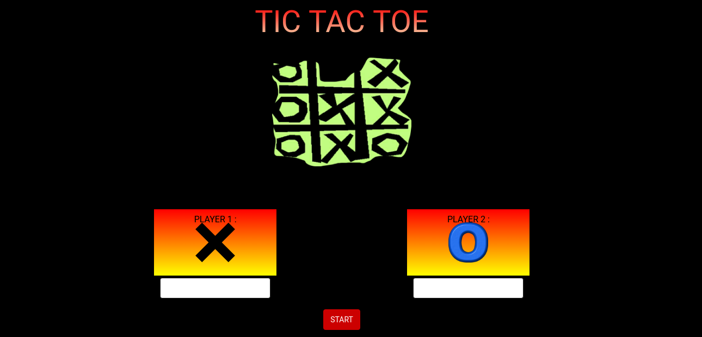
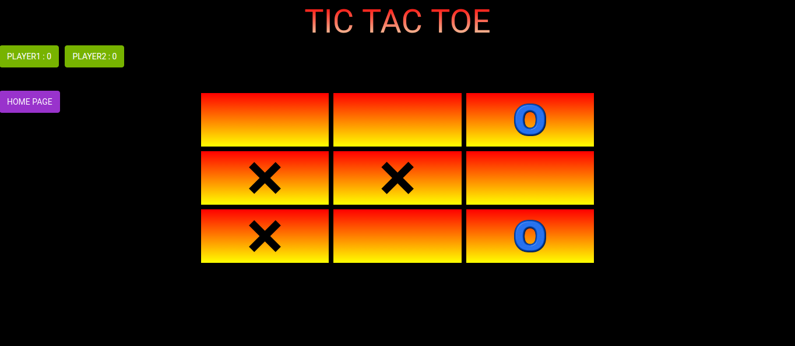

# TIC-TAC-TOE-angular-js-

- Tic-tac-toe (also known as noughts and crosses or Xs and Os) is a game for two players who take turns marking the spaces in a 3×3 grid. The player who succeeds in placing three of their marks in a horizontal, vertical, or diagonal row wins the game.
This is tic-tac-toe implementation using angular-js.
- Have a demo [here](https://tic-tac-toe-6f38f.firebaseapp.com/)

### SCREENSHOTS :-

    

    

    

